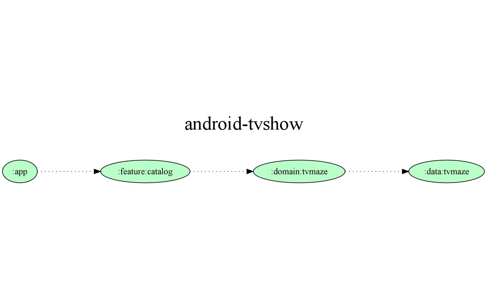

# Android TvMaze Project

### Resumo

Este é um simples projeto Andrid utilizando a Arquitetura MVVM Clean Arch.
 - Koin para injeção de dependência.
 - Coroutines + Flow para controle assíncrono do aplicativo.
 - Multi-módulos para melhor separação da responsabilidades.
 - O arquivo TOML para gerenciar as bibliotecas.

### Estruturção do App

  

Eu dividi em três módulos sem contar o módulo **:app**, segundos os padrões do Clean Code com as camadas:
 - Presentation: **:feature**:catalog
 - Domain: **:domain**:tvmaze
 - Data: **:data**:tvmaze

A imagem foi gerada pelo **task** `projectDependencyGraph`, use o site [Graphviz](https://renenyffenegger.ch/notes/tools/Graphviz/examples/index), para entender como criar o grafo.

### Funcionalidade

O Aplicativo é bem simple, ele basicamente lista as Séries que a api [TvMaze](https://www.tvmaze.com/api) fornece através da [API](https://github.com/drsjr/android-tvshow/blob/master/data/tvmave/src/main/java/tour/donnees/data/tvmaze/datasource/remote/api/TvMazeApi.kt).

O seu uso é bem simples:

  

